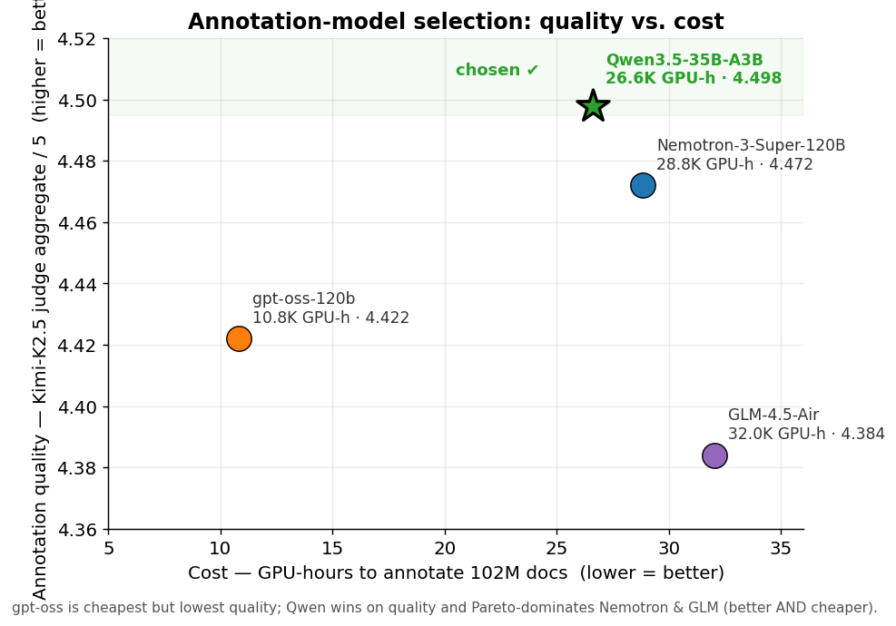
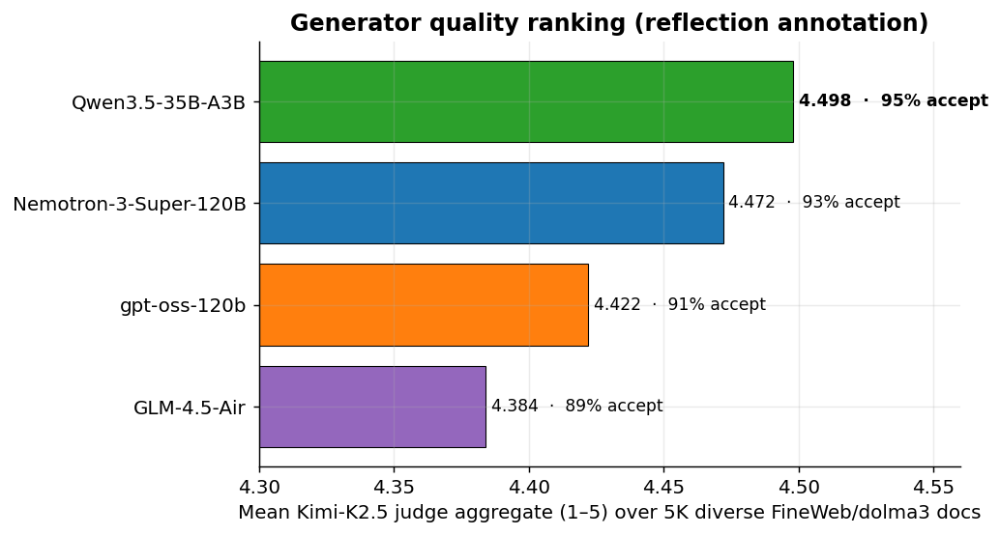
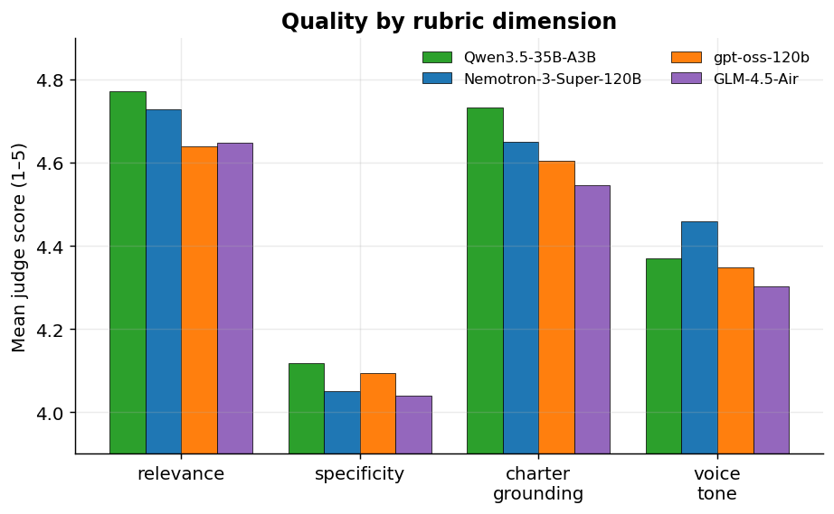
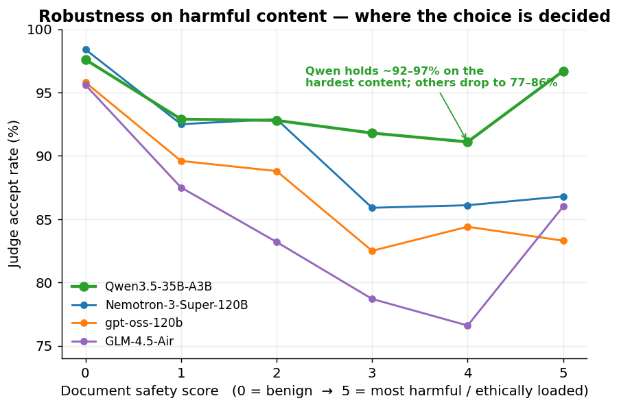

# Choosing the annotation model

How we picked the model that annotates the pretraining corpus (charter
reflections + preflections over ~102 M FineWeb/dolma3 documents).

**Decision: `Qwen3.5-35B-A3B-FP8`.** It produced the highest-quality
charter annotations of every candidate we could afford to run at scale, was
the most robust on harmful/ethically-loaded content (the part that actually
matters), and Pareto-dominates the next-best models — better *and* cheaper.



| Model | Judge aggregate ↑ | Accept rate ↑ | GPU-h / 102 M ↓ | Active / total params | Verdict |
|---|:--:|:--:|:--:|:--:|---|
| **Qwen3.5-35B-A3B-FP8** | **4.498** | **95.4 %** | 26.6 K | 3 B / 35 B | **chosen** |
| Nemotron-3-Super-120B-A12B-FP8 | 4.472 | 93.4 % | 28.8 K | 12 B / 120 B | dominated (worse + pricier) |
| gpt-oss-120b | 4.422 | 90.6 % | 10.8 K | 5 B / 120 B | cheapest, but lowest quality |
| GLM-4.5-Air-FP8 | 4.384 | 88.8 % | 32.0 K | 12 B / 106 B | dominated (worst + priciest) |

*Quality from `charter.eval` (`ref_v3` + `ref_v4_qwen`), gold judge Kimi-K2.5
over a 5 K diverse-pool; cost from the throughput benchmarks (4-voice prompt,
tuned SGLang). Sources at the bottom.*

---

## The process: a two-stage funnel

Annotating 102 M documents is expensive, and annotation quality is only
weakly correlated with raw model size, so we screened on **cost first**, then
ran a **quality bake-off** on the survivors.

```
~10 candidate models
        │   Stage 1 — throughput / cost screen
        │   (benchmark sps on GH200, extrapolate GPU-h for 102M)
        ▼
4 affordable candidates ── gpt-oss-120b, GLM-4.5-Air, Qwen3.5-35B-A3B, Nemotron-3-Super
        │   Stage 2 — quality bake-off
        │   (charter.eval: 5K diverse pool, frontier gold judge)
        ▼
   Qwen3.5-35B-A3B-FP8  ✔
```

## Stage 1 — cost / throughput screen

Each candidate was served with SGLang on a single GH200 node (4 GPUs), driven
at saturation, and its samples/sec extrapolated to the full 102 M-document
corpus. The screen eliminated models whose scale cost was prohibitive
regardless of quality:

| Model | GPU-h for 102 M | Status |
|---|--:|---|
| gpt-oss-120b | ~10.8 K | → quality bake-off |
| **Qwen3.5-35B-A3B-FP8** | ~26.6 K | → quality bake-off |
| Nemotron-3-Super-120B-A12B-FP8 | ~28.8 K | → quality bake-off |
| GLM-4.5-Air-FP8 | ~32.0 K | → quality bake-off |
| Qwen3.5-122B-A10B-FP8 | ~88.9 K | screened out — too expensive |
| GLM-4.5-Air (bf16) | ~217 K | screened out |
| Qwen3.5-397B-A17B | ~827 K | screened out |
| Kimi-K2.5 | ~1.7 M | screened out (kept as the *judge*) |

Two findings from this stage drove most of the savings and are reused by the
production runs:

- **FP8 + data-parallel, not tensor-parallel.** For models that fit on one
  GPU, `TP1×DP4` is ~2.4× cheaper than `TP4×DP1`. Don't shard what fits.
- **Hybrid (Mamba/DeltaNet) models need tuning.** `--mamba-ssm-dtype bfloat16`
  + `--mem-fraction-static 0.88` + a re-balanced Mamba/KV pool cut Qwen3.5-35B
  by 18 % and Nemotron-3-Super by 43 % vs. defaults. The residual bottleneck is
  memory-bandwidth-bound MoE decode (256 fine-grained experts), confirmed by a
  16-config flag sweep and a Triton MoE kernel re-tune — no further config wins.

(The bigger Qwen3.5-122B/397B and Kimi were never going to be cost-competitive
for a full-corpus pass; Kimi-K2.5 earns its keep as the held-out **judge**, not
the annotator.)

## Stage 2 — quality bake-off (`charter.eval`)

The four affordable survivors each annotated the **same 5 000-document pool**
(dolma3, stratified across safety scores 0–5) with the frozen reflection prompt
`generator_reflection_v7.md`. Every annotation was then scored 1–5 by a
**held-out frontier judge, Kimi-K2.5** (`judge_reflection_v24.md`) on four
rubric dimensions — `relevance`, `specificity`, `charter_grounding`,
`voice_tone` — for both the first- and third-person voices.



Qwen3.5-35B-A3B leads on the headline aggregate **and** on three of the four
rubric dimensions (it trails only Nemotron on `voice_tone`):



### Where the decision is actually made: harmful content

The aggregate gaps are small (4.38–4.50). What separates the models is
**behaviour on the documents that matter** — the harmful / ethically-loaded
ones, which are precisely the documents a charter annotation exists to handle.



On benign text (safety 0) every model is fine (~96–98 % accept). As content
gets harder, the others degrade sharply — GLM-4.5-Air falls to **77 %** at
safety 4, gpt-oss and Nemotron to **84–86 %** — while **Qwen holds 91–97 %
across the entire range.** That robustness on the hard tail, not the
fractional aggregate lead, is the deciding factor.

### Why these numbers are trustworthy

- **Same prompt, same pool, same judge** for all candidates (one exception:
  Nemotron ran a model-specific prompt variant, `generator_reflection_v9.md`).
- **Unequal sample counts don't bias the ranking.** Qwen's judgments were
  completed in a sibling run (`ref_v4_qwen`, n≈3.2 K) vs. ~4.7 K for the
  others. Re-scoring on the **3 158 documents common to all four** gives the
  identical order and near-identical values (Qwen 4.501 > Nemotron 4.492 >
  gpt-oss 4.450 > GLM 4.402).
- **Scope:** the bake-off scored the *reflection* voice (the harder,
  mid-document annotation). The same model serves preflection in production.

## Outcome & production config

`Qwen3.5-35B-A3B-FP8` is frozen as the annotation model. Prompts live in
[`final_prompts/qwen3.5-35b-a3b/`](../final_prompts/qwen3.5-35b-a3b/) and the
scale-up runs are in [`charter/scale/`](charter/scale/).

In production the reflection and preflection passes use **separate prompts and
API calls**, so the real reflection-only cost is lower than the 4-voice screen
figure: **~22.4 K GPU-h**, trimmed to **~21.9 K** after the Mamba/KV pool
re-balance (`--mamba-full-memory-ratio 2.0`). The 50 %-corpus run
(`EXP-002`, 51.4 M reflections) came in at **~13 K GPU-h**, matching the
linear estimate within 4 %.

Winning SGLang config (GH200, per node):

```
--tp-size 1 --dp-size 4 --context-length 16384 \
--kv-cache-dtype bf16 --mamba-ssm-dtype bfloat16 \
--mem-fraction-static 0.88 --mamba-full-memory-ratio 2.0 \
--max-running-requests 512 --schedule-conservativeness 0.3 \
--cuda-graph-max-bs 1024
# client concurrency: 1024
```

## Reproduce

```bash
# Quality ranking (combines the two run dirs that hold the four candidates)
uv run python -m pipeline.charter.eval rank-generators ref_v3 ref_v4_qwen

# Regenerate the figures in this doc
uv run python pipeline/assets/model_selection/make_plots.py
```

## Sources

| What | Where |
|---|---|
| Quality eval (generations + Kimi-K2.5 judgments) | `data/pipeline/charter_eval/ref_v3/`, `ref_v4_qwen/` |
| Ranking logic (`mean_aggregate`, accept-by-safety) | `pipeline/charter/eval/rank.py` |
| Throughput / GPU-h benchmarks & SGLang tuning | `throughput_estimations/README.md` (see git history) |
| Frozen winning prompts | `final_prompts/qwen3.5-35b-a3b/` |
| Scale-up runs & costs | `pipeline/charter/scale/EXPERIMENTS.md` |
| Figure-generation script | `pipeline/assets/model_selection/make_plots.py` |
